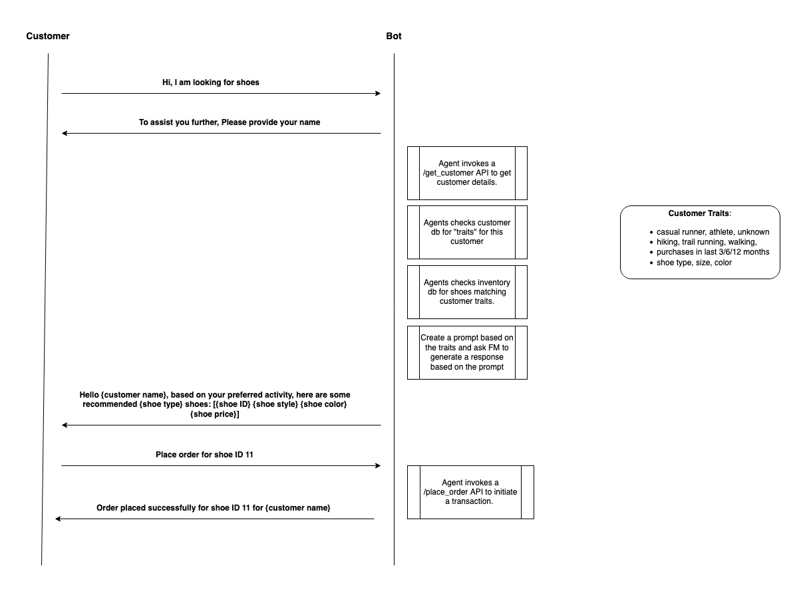
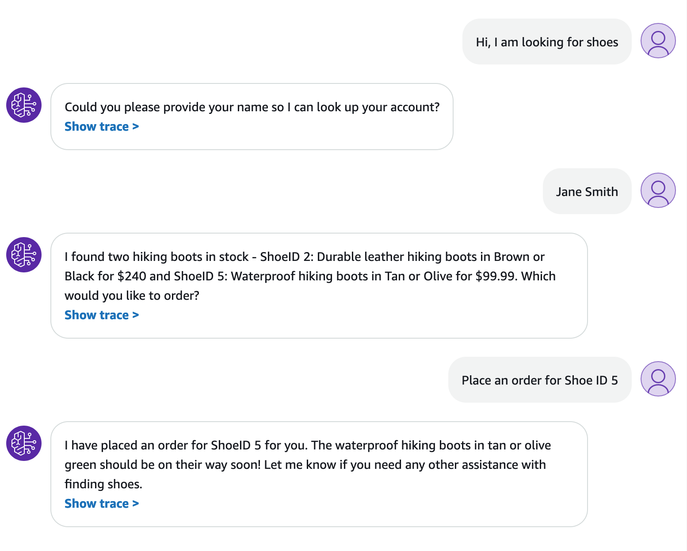
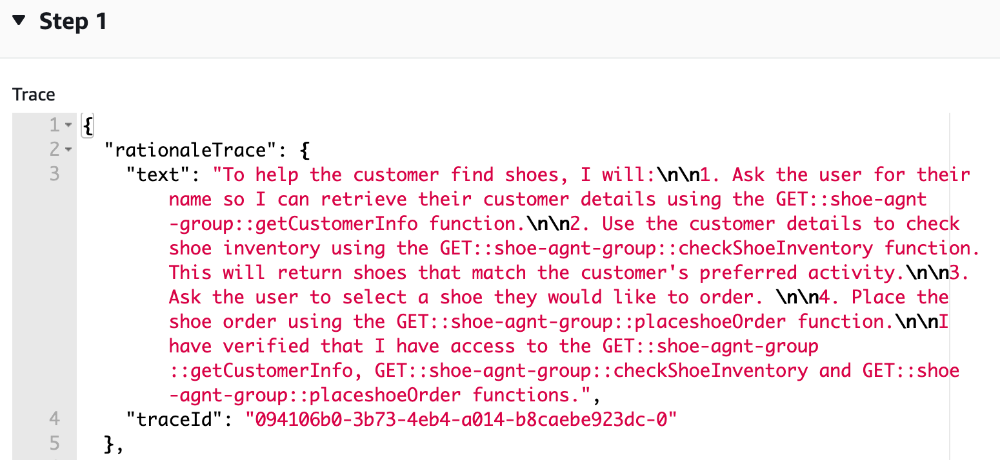

# Build a foundation model (FM) powered customer service bot with agents for Amazon Bedrock

From enhancing the conversational experience to agent assistance, there are plenty of ways that generative artificial intelligence (AI) and foundation models (FMs) can help deliver faster, better support. With the increasing availability and diversity of FMs, it’s difficult to experiment and keep up-to-date with the latest model versions. [Amazon Bedrock](https://aws.amazon.com/bedrock/) is a fully managed service that offers a choice of high-performing FMs from leading AI companies such as AI21 Labs, Anthropic, Cohere, Meta, Stability AI, and Amazon. With Amazon Bedrock’s comprehensive capabilities, you can easily experiment with a variety of top FMs, customize them privately with your data using techniques such as fine-tuning and Retrieval Augmented Generation (RAG).

### Agents for Amazon Bedrock

In July, AWS announced the preview of [agents for Amazon Bedrock](https://aws.amazon.com/bedrock/agents/), a new capability for developers to create fully managed agents in a few clicks. Agents extend FMs to run complex business tasks—from booking travel and processing insurance claims to creating ad campaigns and managing inventory—all without writing any code. With fully managed agents, you don’t have to worry about provisioning or managing infrastructure.

In this post, we provide a step-by-step guide with building blocks to create a customer service bot. We use a text generation model ([Anthropic Claude V2](https://www.anthropic.com/index/claude-2)) and agents for Amazon Bedrock for this solution. We provide an [AWS CloudFormation](https://aws.amazon.com/cloudformation/) template to provision the resources needed for building this solution. Then we walk you through steps to create an agent for Amazon Bedrock.

### ReAct Prompting

FMs determine how to solve user-requested tasks with a technique called [ReAct](https://react-lm.github.io/). It’s a general paradigm that combines reasoning and acting with FMs. ReAct prompts FMs to generate verbal reasoning traces and actions for a task. This allows the system to perform dynamic reasoning to create, maintain, and adjust plans for acting while incorporating additional information into the reasoning. The structured prompts include a sequence of question-thought-action-observation examples.

* The question is the user-requested task or problem to solve. 
* The thought is a reasoning step that helps demonstrate to the FM how to tackle the problem and identify an action to take. 
* The action is an API that the model can invoke from an allowed set of APIs. 
* The observation is the result of carrying out the action.

### Components in agents for Amazon Bedrock

Behind the scenes, agents for Amazon Bedrock automate the prompt engineering and orchestration of user-requested tasks. They can securely augment the prompts with company-specific information to provide responses back to the user in natural language. The agent breaks the user-requested task into multiple steps and orchestrates subtasks with the help of FMs. Action groups are tasks that the agent can perform autonomously. Action groups are mapped to an [AWS Lambda](https://aws.amazon.com/lambda/) function and related API schema to perform API calls. The following diagram depicts the agent structure.

### Solution overview

We use a shoe retailer use case to build the customer service bot. The bot helps customers purchase shoes by providing options in a humanlike conversation. Customers converse with the bot in natural language with multiple steps invoking external APIs to accomplish subtasks. The following diagram illustrates the sample process flow.

The following diagram depicts a high-level architecture of this solution.

1.	You can create an agent with Bedrock-supported FMs such as Anthropic Claude V2.

2.	Attach API schema, residing in an [Amazon Simple Storage Service (Amazon S3)](https://aws.amazon.com/s3/) bucket, and a Lambda function containing the business logic to the agent. (Note: This is a one-time setup step.)

3.	The agent uses customer requests to create a prompt using the ReAct framework. It, then, uses the API schema to invoke corresponding code in the Lambda function.

4.	You can perform a variety of tasks including sending email notifications, writing to databases, triggering application APIs in the Lambda functions.

In this post, we use the Lambda function to retrieve customer details, list shoes matching customer-preferred activity, and finally, place orders. Our code is backed by an in-memory SQLite database. You can use similar constructs to write to a persistent data store.

### Prerequisites

To implement the solution provided in this post, you should have an [AWS account](https://signin.aws.amazon.com/signin?redirect_uri=https%3A%2F%2Fportal.aws.amazon.com%2Fbilling%2Fsignup%2Fresume&client_id=signup) and access to Amazon Bedrock with agents enabled (currently in preview). Use AWS CloudFormation template to create the resource stack required for the solution.

|             |                                          |
| :---------- | :--------------------------------------: |
| `us-east-1` |  |

The CloudFormation template creates two IAM roles. Update these roles to apply least-privilege permissions as discussed in [Security best practices](https://docs.aws.amazon.com/IAM/latest/UserGuide/best-practices.html#grant-least-privilege). Click [here](https://docs.aws.amazon.com/bedrock/latest/userguide/security_iam_service-with-iam-agent.html) to learn what IAM features are available to use with agents for Amazon Bedrock.

1.	`LambdaBasicExecutionRole` with S3 full access and CloudWatch access for logging.
2.	`AmazonBedrockExecutionRoleForAgents` with S3 full access and Lambda full access. 

**Important:** Agents for Amazon Bedrock requires the role name to be prefixed by `AmazonBedrockExecutionRoleForAgents_*`

### Bedrock Agents setup

In the next two sections, we will walk you through creating and testing an agent.

#### Create an Agent for Amazon Bedrock

To create an agent, open the [Amazon Bedrock console](https://console.aws.amazon.com/bedrock/home) and choose **Agents** in the left navigation pane. Then select **Create Agent**.

This starts the agent creation workflow.

1.	**Provide agent details:** Give the agent a name and description (optional). Select the service role created by the CloudFormation stack and select **Next**.

2.	**Select a foundation model:** In the **Select model** screen, you select a model. Provide clear and precise instructions to the agent about what tasks to perform and how to interact with the users.

3.	**Add action groups:** An action is a task the agent can perform by making API calls. A set of actions comprise an action group. You provide an API schema that defines all the APIs in the action group. You must provide an API schema in the [OpenAPI schema](https://swagger.io/specification/) JSON format. The Lambda function contains the business logic needed to perform API calls. You must associate a Lambda function to each action group.

Give the action group a name and a description for the action. Select the Lambda function, provide an API schema file and select **Next**.

4.	In the final step, review the agent configuration and select **Create Agent**.

#### Test/Deploy agents for Amazon Bedrock

1.	**Test the agent:** After the agent is created, a dialog box shows the agent overview along with a working draft. The Amazon Bedrock console provides a UI to test your agent.

2.	**Deploy:** After successful testing, you can deploy your agent. To deploy an agent in your application, you must create an alias. Amazon Bedrock then automatically creates a version for that alias.

The following actions occur with the preceding agent setup and the Lambda code provided with this post:

1.	The agent creates a prompt from the developer-provided instructions (such as “You are an agent that helps customers purchase shoes.”), API schemas needed to complete the tasks, and data source details. The automatic prompt creation saves weeks of experimenting with prompts for different FMs. 

2.	The agent orchestrates the user-requested task, such as “I am looking for shoes,” by breaking it into smaller subtasks such as getting customer details, matching the customer-preferred activity with shoe activity, and placing shoe orders. The agent determines the right sequence of tasks and handles error scenarios along the way.

The following screenshot displays some example responses from the agent.

By selecting **Show trace** for each of response, a dialog box shows the reasoning technique used by the agent and the final response generated by the FM.

### Cleanup

To avoid incurring future charges, delete the resources. You can do this by deleting the stack from the CloudFormation console.

Feel free to download and test the code used in this post from the GitHub [agents for Amazon Bedrock repository](https://github.com/aws-samples/agentsforbedrock-retailagent). You can also invoke the agents for Amazon Bedrock programmatically; an [example Jupyter Notebook](https://github.com/aws-samples/agentsforbedrock-retailagent/tree/main/workshop) is provided in the repository.

### Conclusion

Agents for Amazon Bedrock can help you increase productivity, improve your customer service experience, or automate DevOps tasks. In this post, we showed you how to set up agents for Amazon Bedrock to create a customer service bot.

We encourage you to learn more by reviewing [additional features](https://aws.amazon.com/bedrock/knowledge-bases/) of Amazon Bedrock. You can use the example code provided in this post to create your implementation. Try our [workshop](https://catalog.us-east-1.prod.workshops.aws/workshops/a4bdb007-5600-4368-81c5-ff5b4154f518/en-US) to gain hands-on experience with Amazon Bedrock.
